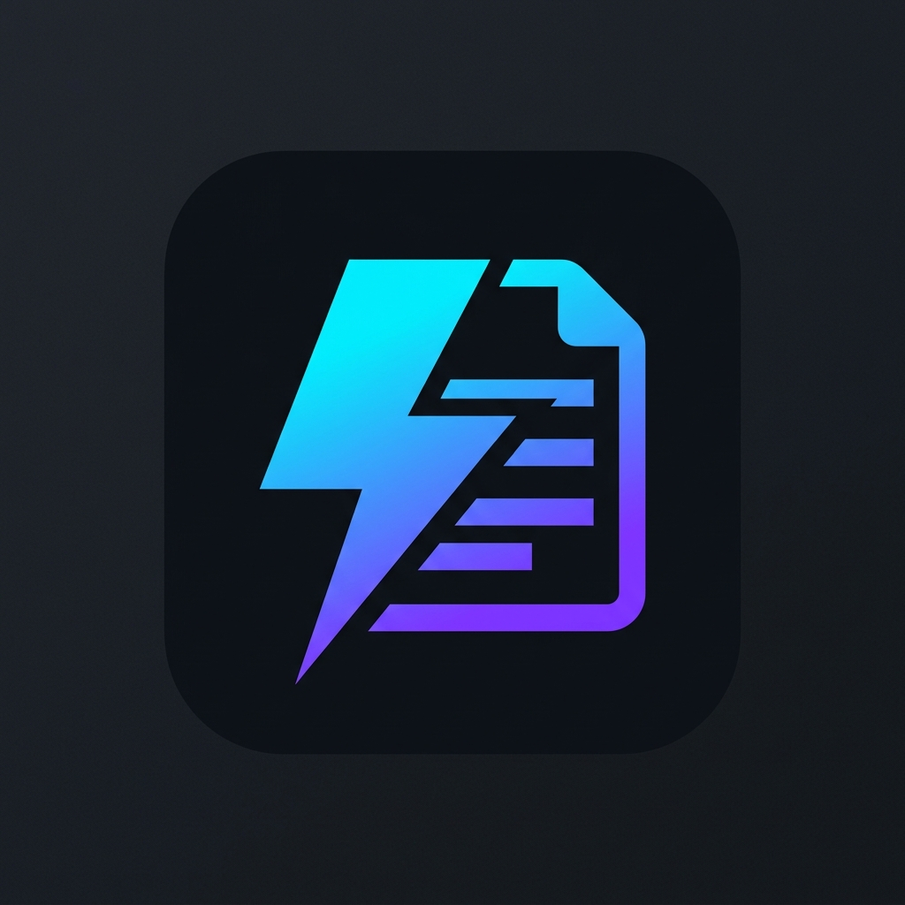

<p align="center">
  
</p>

<h1 align="center">⚡ CTXR — AI Context Packager</h1>

<p align="center">
  <strong>Compress. Optimize. Ship cleaner prompts to any LLM.</strong>
</p>

<p align="center">
  
  
  
  
  
</p>

<p align="center">
  
  
  
</p>

---

## 🎯 What is CTXR?

**CTXR** is a production-ready **document normalization + prompt optimization engine** that packages messy data (PDFs, DOCX, PPTX, Images) into clean, token-efficient Markdown — and optimizes your LLM prompts inline with a single click.

| Feature | Description |
|:--------|:------------|
| 📄 **Document Normalizer** | Converts PDFs, Word docs, PowerPoints, and images into structured GFM Markdown |
| ⚡ **Prompt Optimizer** | 7-stage rule-based compression + Gemini AI rewriting for deeper semantic condensation |
| 🧩 **Chrome Extension** | Inline **⚡ Optimize** button injected directly into ChatGPT, Claude & Gemini prompt bars |
| 🔢 **Token Analytics** | Real-time token count tracking with savings percentages and cost estimates |
| 🤖 **AI-Vision OCR** | Multimodal Gemini 2.0 Flash for chart/table/layout extraction from images |

---

## 🧩 Chrome Extension — Install in 30 Seconds

> **Users only need the extension — no backend setup required!**  
> The extension connects to the cloud API automatically.

### Quick Install

1. **Download** → [`ctxr-extension.zip`](ctxr-extension.zip)
2. **Unzip** the file to any folder
3. Open **`chrome://extensions/`** in your browser
4. Enable **Developer Mode** (top-right toggle)
5. Click **"Load unpacked"** → select the unzipped folder
6. ✅ Done! The ⚡ CTXR icon appears in your toolbar

### How It Works

| Step | Action |
|:----:|:-------|
| **1** | Open **ChatGPT**, **Claude**, or **Gemini** |
| **2** | Type your prompt in the chat input |
| **3** | Click the **⚡ Optimize** pill button that appears |
| **4** | Your prompt is instantly compressed & optimized inline |

### Extension Features
- 🟢 **CLOUD** mode — uses the live deployed backend (zero setup)
- 🟡 **LOCAL** mode — auto-detects if you're running the backend locally
- 🔴 **STANDALONE** mode — basic rule-based optimization works offline

---

## 🛠️ Tech Stack

| Layer | Technology |
|:------|:-----------|
| **Language** | Python 3.12+ (fully type-safe) |
| **REST Framework** | FastAPI (async ASGI) |
| **Local Parsers** | `pymupdf` · `python-docx` · `python-pptx` |
| **AI Engine** | Google Gemini 2.0 Flash via `google-genai` SDK |
| **Tokenizer** | `tiktoken` (GPT-4 compatible) |
| **Validation** | Pydantic v2 |
| **Extension** | Chrome Manifest V3 |
| **Deployment** | Docker + Render |

---

## 📂 Project Structure

```text
CTXR/
├── 🧩 extension/               # Chrome Extension (Manifest V3)
│   ├── manifest.json
│   ├── icon.png                 # Extension icon
│   ├── popup.html / .css / .js  # Extension popup UI
│   ├── content.js               # Inline ⚡ Optimize button for LLM pages
│   └── background.js            # Service worker
│
├── 🐍 contextforge/            # Python Backend Engine
│   ├── core/models.py           # Pydantic domain models
│   ├── adapters/
│   │   ├── local_parsers.py     # PDF, Word, PPTX parsers
│   │   └── ai_parser.py         # Gemini AI-Vision OCR + prompt rewriter
│   ├── services/
│   │   ├── compression.py       # Syntax compressor & deduplication
│   │   ├── chunking.py          # Heading-aware semantic chunker
│   │   └── prompt_optimizer.py  # 7-stage prompt optimization pipeline
│   └── api/app.py               # FastAPI REST endpoints
│
├── 🧪 tests/                   # 61 automated tests
├── 📦 Dockerfile               # Production container
├── 📋 render.yaml              # Render deployment blueprint
├── 📄 requirements.txt
└── 🚀 main.py                  # Application entrypoint
```

---

## 🚀 Getting Started (Backend Development)

### 1. Clone & Setup
```bash
git clone https://github.com/Porallanagaraju13/CTXR.git
cd CTXR
python -m venv venv
# Windows
.\venv\Scripts\Activate.ps1
# macOS/Linux
source venv/bin/activate
pip install -r requirements.txt
```

### 2. Environment Config
Create a `.env` file from the example:
```bash
cp .env.example .env
```
Then add your Gemini API key:
```ini
GEMINI_API_KEY=your_gemini_api_key_here
ENVIRONMENT=development
LOG_LEVEL=INFO
```

### 3. Run Dev Server
```bash
python main.py web
```
- 🔗 Health check: `http://127.0.0.1:8000/health`
- 📖 Swagger docs: `http://127.0.0.1:8000/docs`

---

## 🧪 Testing

```bash
python -m pytest -v
```

```
========= 61 passed in 3.93s =========
```

---

## 🔗 API Endpoints

### `GET /health`
Returns service status and supported formats.

### `POST /normalize`
Converts uploaded documents into token-efficient Markdown.

| Parameter | Type | Description |
|:----------|:-----|:------------|
| `file` | Upload | PDF, DOCX, PPTX, PNG, JPG, WEBP |
| `use_ai` | bool | Use Gemini AI-Vision OCR pipeline |

<details>
<summary>📋 Example Response</summary>

```json
{
  "document_name": "quarterly_report.pdf",
  "full_markdown": "# Q2 Financial Highlights\n\n| Region | Revenue |\n|---|---|\n| NA | $4.2M |",
  "metrics": {
    "raw_tokens_estimate": 45000,
    "compressed_tokens": 12000,
    "tokens_saved": 33000,
    "savings_percentage": 73.33
  }
}
```
</details>

### `POST /optimize-prompt`
Optimizes raw prompts with 7-stage compression + optional AI rewriting.

| Parameter | Type | Default | Description |
|:----------|:-----|:--------|:------------|
| `prompt` | string | — | Raw prompt text |
| `use_ai` | bool | `true` | Enable Gemini AI rewriting |
| `target_model` | string | `gpt-4` | Tokenizer target model |

<details>
<summary>📋 Example Response</summary>

```json
{
  "original_prompt": "I would like you to please help me create a Python function...",
  "optimized_prompt": "Create a Python function. Validate all input parameters.",
  "optimization_techniques": [
    "Filler word removal",
    "Redundant phrase compression",
    "Whitespace normalization"
  ],
  "metrics": {
    "raw_tokens_estimate": 38,
    "compressed_tokens": 18,
    "tokens_saved": 20,
    "savings_percentage": 52.63
  }
}
```
</details>

### ⚡ Optimization Techniques (7 Stages)

| # | Technique | Example |
|:-:|:----------|:--------|
| 1 | **Filler Removal** | "please", "kindly", "just" → removed |
| 2 | **Phrase Compression** | "in order to" → "To" |
| 3 | **Qualifier Stripping** | "very important" → "important" |
| 4 | **Passive Simplification** | "it is recommended that" → "Recommend:" |
| 5 | **Deduplication** | Repeated lines → kept once |
| 6 | **Markdown Structuring** | "Section:" → `## Section` |
| 7 | **Whitespace Normalization** | Excessive spaces → cleaned |

---

## ☁️ Deployment

The backend is deployed on **Render** with Docker:

```
Live API: https://contextforge-kub5.onrender.com
```

Deploy your own instance:
1. Fork this repository
2. Create a new **Web Service** on [Render](https://render.com)
3. Connect your GitHub repo → Render auto-detects the `Dockerfile`
4. Add `GEMINI_API_KEY` as an environment variable
5. Deploy! 🚀

---

## 📜 License

MIT License — use it, fork it, build on it.

---

<p align="center">
  <strong>Built with ⚡ by <a href="https://github.com/Porallanagaraju13">Porallanagaraju13</a></strong>
</p>
