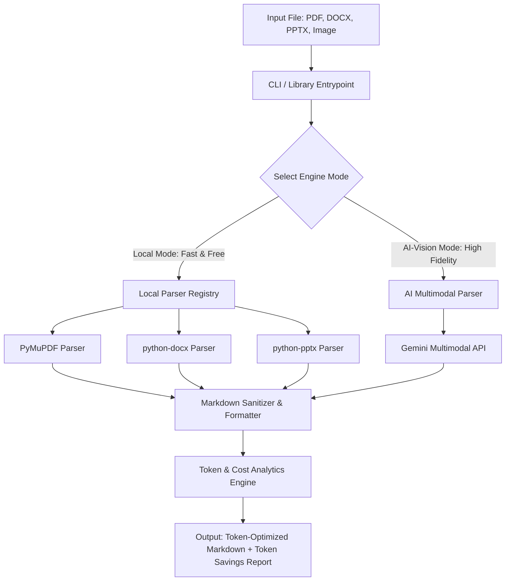

# DocNormalizer Implementation Plan

> **For Claude / Antigravity:** REQUIRED SUB-SKILL: Use superpowers:executing-plans to implement this plan task-by-task.

**Goal:** Build a robust, highly modular CLI tool and Python library (`DocNormalizer`) that converts PDF, DOCX, PPTX, and Images into clean, token-efficient, LLM-ready Markdown, featuring both a local extraction pipeline and an AI-Vision-based extraction pipeline with real-time token savings analytics.

**Architecture:** A registry-based parser factory orchestrating specialized parser engines for each file format. Integrates a local extractor engine (using `fitz`/PyMuPDF, `python-docx`, `python-pptx`) for speed/cost, and a remote vision engine (using `google-genai`) for complex layout/table OCR. Includes a token metrics calculator for computing and showing token reduction stats (before vs. after).



**Tech Stack:**
- **Language**: Python 3.10+
- **Parsing**: `pymupdf` (PyMuPDF), `python-docx`, `python-pptx`
- **AI/Vision**: `google-genai` (official Google Gemini API client)
- **Token Analytics**: `tiktoken` (for token estimation)
- **CLI / UI**: `rich` (for gorgeous terminal visuals and progress bars)
- **Testing**: `pytest`

---

## Part 1: Project Scaffolding & Core Architecture

### Task 1: Initialize Workspace & Poetry/Pip Environment
**Files:**
- Create: `D:\TK\pyproject.toml`
- Create: `D:\TK\requirements.txt`
- Create: `D:\TK\.env.example`

**Step 1: Write requirements.txt & pyproject.toml**
Define the dependencies for the local and AI engines. We will use modern and stable libraries.

`D:\TK\requirements.txt` contents:
```text
pymupdf>=1.24.0
python-docx>=1.1.0
python-pptx>=0.6.23
google-genai>=0.2.0
tiktoken>=0.6.0
rich>=13.7.0
python-dotenv>=1.0.1
pytest>=8.0.0
```

`D:\TK\.env.example` contents:
```ini
# Gemini API Key for AI-Vision parsing mode
GEMINI_API_KEY=your_gemini_api_key_here
```

**Step 2: Initialize Git Repository**
Run the shell commands in `D:\TK` to set up git and prepare folders.

Run in terminal:
```powershell
cd D:\TK
git init
python -m venv venv
.\venv\Scripts\Activate.ps1
pip install -r requirements.txt
```
Expected: Python virtual environment successfully created and libraries installed.

**Step 3: Commit Workspace Scaffolding**
```bash
git add requirements.txt .env.example
git commit -m "chore: scaffold project requirements and environments"
```

---

### Task 2: Core Base Parser & Registry System
We will create a robust base parser class and a registry factory. This enforces clean, extensible code so adding new document formats takes only minutes.

**Files:**
- Create: `D:\TK\doc_normalizer\__init__.py`
- Create: `D:\TK\doc_normalizer\parsers\base.py`
- Create: `D:\TK\doc_normalizer\parsers\__init__.py`
- Create: `D:\TK\tests\test_base_parser.py`

**Step 1: Write Base Parser Interfaces**
Create the abstract base parser in `D:\TK\doc_normalizer\parsers\base.py`:
```python
from abc import ABC, abstractmethod
from pathlib import Path

class BaseParser(ABC):
    """Abstract base class for all document parsers."""
    
    @abstractmethod
    def can_handle(self, filepath: Path) -> bool:
        """Return True if this parser can handle the given file extension."""
        pass
        
    @abstractmethod
    def parse(self, filepath: Path, **kwargs) -> str:
        """Parse the document and return a clean Markdown string."""
        pass
```

Create the parser registry in `D:\TK\doc_normalizer\parsers\__init__.py`:
```python
from pathlib import Path
from typing import Dict, Type, List
from doc_normalizer.parsers.base import BaseParser

class ParserRegistry:
    def __init__(self):
        self._parsers: List[BaseParser] = []
        
    def register(self, parser: BaseParser):
        self._parsers.append(parser)
        
    def get_parser(self, filepath: Path) -> BaseParser:
        for parser in self._parsers:
            if parser.can_handle(filepath):
                return parser
        raise ValueError(f"No registered parser can handle file: {filepath.suffix}")

registry = ParserRegistry()
```

**Step 2: Write Unit Test for base parser registry**
Create `D:\TK\tests\test_base_parser.py`:
```python
import pytest
from pathlib import Path
from doc_normalizer.parsers.base import BaseParser
from doc_normalizer.parsers import ParserRegistry

class DummyParser(BaseParser):
    def can_handle(self, filepath: Path) -> bool:
        return filepath.suffix.lower() == ".txt"
    def parse(self, filepath: Path, **kwargs) -> str:
        return "# Dummy Content"

def test_registry_registration():
    registry = ParserRegistry()
    parser = DummyParser()
    registry.register(parser)
    
    resolved = registry.get_parser(Path("test.txt"))
    assert resolved == parser
    
    with pytest.raises(ValueError):
        registry.get_parser(Path("test.pdf"))
```

**Step 3: Run pytest to verify**
Run: `pytest tests/test_base_parser.py -v`
Expected: PASS

**Step 4: Commit**
```bash
git add doc_normalizer/ tests/
git commit -m "feat: implement base parser abstraction and registry system"
```

---

## Part 2: Local Parsers Implementation

### Task 3: DOCX to Markdown Parser
DOCX files contain structured XML. We will extract titles, headings (Heading 1-6), lists, tables, bold/italic formatting, and join them into clean GFM (GitHub Flavored Markdown).

**Files:**
- Create: `D:\TK\doc_normalizer\parsers\docx_parser.py`
- Create: `D:\TK\tests\test_docx_parser.py`

**Step 1: Write Word DOCX Parser**
Implement `D:\TK\doc_normalizer\parsers\docx_parser.py`:
```python
from pathlib import Path
import docx
from doc_normalizer.parsers.base import BaseParser

class DocxParser(BaseParser):
    def can_handle(self, filepath: Path) -> bool:
        return filepath.suffix.lower() in [".docx"]
        
    def parse(self, filepath: Path, **kwargs) -> str:
        doc = docx.Document(str(filepath))
        markdown_lines = []
        
        for element in doc.element.body:
            # We process paragraphs and tables sequentially to maintain document flow
            if element.tag.endswith('p'):
                p = docx.text.paragraph.Paragraph(element, doc)
                text = self._parse_paragraph(p)
                if text:
                    markdown_lines.append(text)
            elif element.tag.endswith('tbl'):
                t = docx.table.Table(element, doc)
                table_md = self._parse_table(t)
                if table_md:
                    markdown_lines.append(table_md)
                    
        return "\n\n".join(markdown_lines)

    def _parse_paragraph(self, p) -> str:
        text = ""
        for run in p.runs:
            run_text = run.text
            if not run_text:
                continue
            if run.bold:
                run_text = f"**{run_text}**"
            if run.italic:
                run_text = f"*{run_text}*"
            text += run_text
            
        text = text.strip()
        if not text:
            return ""
            
        style_name = p.style.name.lower()
        if "heading 1" in style_name:
            return f"# {text}"
        elif "heading 2" in style_name:
            return f"## {text}"
        elif "heading 3" in style_name:
            return f"### {text}"
        elif "heading 4" in style_name:
            return f"#### {text}"
        elif "list bullet" in style_name:
            return f"- {text}"
        elif "list number" in style_name:
            return f"1. {text}"
        return text

    def _parse_table(self, table) -> str:
        rows = table.rows
        if not rows:
            return ""
            
        md_rows = []
        # Header Row
        headers = [cell.text.strip().replace("\n", " ") for cell in rows[0].cells]
        md_rows.append("| " + " | ".join(headers) + " |")
        md_rows.append("| " + " | ".join(["---"] * len(headers)) + " |")
        
        # Data Rows
        for row in rows[1:]:
            cells = [cell.text.strip().replace("\n", " ") for cell in row.cells]
            md_rows.append("| " + " | ".join(cells) + " |")
            
        return "\n".join(md_rows)
```

**Step 2: Write DOCX Parser Unit Test**
Create `D:\TK\tests\test_docx_parser.py` (creates a small temporary docx file, parses it, and asserts markdown structure):
```python
import pytest
from pathlib import Path
import docx
from doc_normalizer.parsers.docx_parser import DocxParser

def test_docx_parsing(tmp_path):
    # Create a test docx file
    doc_path = tmp_path / "test.docx"
    doc = docx.Document()
    doc.add_heading("Main Title", level=1)
    doc.add_paragraph("This is basic paragraph with ").add_run("bold text").bold = True
    
    # Add a table
    table = doc.add_table(rows=2, cols=2)
    table.cell(0, 0).text = "Col A"
    table.cell(0, 1).text = "Col B"
    table.cell(1, 0).text = "Val A"
    table.cell(1, 1).text = "Val B"
    
    doc.save(str(doc_path))
    
    parser = DocxParser()
    assert parser.can_handle(doc_path) is True
    
    result = parser.parse(doc_path)
    assert "# Main Title" in result
    assert "**bold text**" in result
    assert "| Col A | Col B |" in result
    assert "| Val A | Val B |" in result
```

**Step 3: Run pytest**
Run: `pytest tests/test_docx_parser.py -v`
Expected: PASS

**Step 4: Commit**
```bash
git add doc_normalizer/parsers/docx_parser.py tests/test_docx_parser.py
git commit -m "feat: implement local DOCX to Markdown parser with list and table formatting"
```

---

### Task 4: PPTX to Markdown Parser
Powerpoint slides contain multiple textual boxes and notes. We will extract each slide, titles, standard bullet text, slide notes (crucial context for LLMs that standard text extractors ignore!), and convert them into readable markdown sections.

**Files:**
- Create: `D:\TK\doc_normalizer\parsers\pptx_parser.py`
- Create: `D:\TK\tests\test_pptx_parser.py`

**Step 1: Write Powerpoint PPTX Parser**
Implement `D:\TK\doc_normalizer\parsers\pptx_parser.py`:
```python
from pathlib import Path
from pptx import Presentation
from doc_normalizer.parsers.base import BaseParser

class PptxParser(BaseParser):
    def can_handle(self, filepath: Path) -> bool:
        return filepath.suffix.lower() in [".pptx"]
        
    def parse(self, filepath: Path, **kwargs) -> str:
        prs = Presentation(str(filepath))
        markdown_slides = []
        
        for index, slide in enumerate(prs.slides, start=1):
            slide_content = [f"## Slide {index}"]
            
            # Extract title if present
            if slide.shapes.title:
                slide_content.append(f"### {slide.shapes.title.text.strip()}")
            
            # Extract other text shapes
            texts = []
            for shape in slide.shapes:
                if shape == slide.shapes.title:
                    continue
                if shape.has_text_frame:
                    text_frame = shape.text_frame
                    for paragraph in text_frame.paragraphs:
                        text = paragraph.text.strip()
                        if not text:
                            continue
                        # If list level exists, indent bullet
                        level = paragraph.level
                        if level > 0:
                            texts.append("  " * level + f"- {text}")
                        else:
                            texts.append(text)
                            
            if texts:
                slide_content.append("\n".join(texts))
                
            # Extract Speaker Notes
            if slide.has_notes_slide and slide.notes_slide.notes_text_frame:
                notes = slide.notes_slide.notes_text_frame.text.strip()
                if notes:
                    slide_content.append(f"\n> **Speaker Notes:** {notes}")
                    
            markdown_slides.append("\n\n".join(slide_content))
            
        return "\n\n---\n\n".join(markdown_slides)
```

**Step 2: Write PPTX Parser Unit Test**
Create `D:\TK\tests\test_pptx_parser.py` (creates a small temporary presentation, parses it, and asserts Markdown output matches our slide design):
```python
import pytest
from pathlib import Path
from pptx import Presentation
from doc_normalizer.parsers.pptx_parser import PptxParser

def test_pptx_parsing(tmp_path):
    pptx_path = tmp_path / "test.pptx"
    prs = Presentation()
    slide_layout = prs.slide_layouts[0] # Title slide
    slide = prs.slides.add_slide(slide_layout)
    
    title = slide.shapes.title
    subtitle = slide.placeholders[1]
    title.text = "Hello World Presentation"
    subtitle.text = "Pre-computation is key!"
    
    # Add Speaker Note
    notes_slide = slide.notes_slide
    notes_slide.notes_text_frame.text = "Highlight cost reductions here."
    
    prs.save(str(pptx_path))
    
    parser = PptxParser()
    assert parser.can_handle(pptx_path) is True
    
    result = parser.parse(pptx_path)
    assert "## Slide 1" in result
    assert "### Hello World Presentation" in result
    assert "Pre-computation is key!" in result
    assert "Highlight cost reductions here." in result
```

**Step 3: Run pytest**
Run: `pytest tests/test_pptx_parser.py -v`
Expected: PASS

**Step 4: Commit**
```bash
git add doc_normalizer/parsers/pptx_parser.py tests/test_pptx_parser.py
git commit -m "feat: implement local PPTX to Markdown parser with speaker notes and bullet formats"
```

---

### Task 5: PDF to Markdown Local Parser
We will use `fitz` (PyMuPDF) for high-performance local PDF parsing. PyMuPDF is extremely fast (often 100x faster than alternative parsers). We will write robust code to parse headers, paragraphs, and keep layout elements.

**Files:**
- Create: `D:\TK\doc_normalizer\parsers\pdf_parser.py`
- Create: `D:\TK\tests\test_pdf_parser.py`

**Step 1: Write PDF Local Parser**
Implement `D:\TK\doc_normalizer\parsers\pdf_parser.py`:
```python
from pathlib import Path
import fitz # PyMuPDF
from doc_normalizer.parsers.base import BaseParser

class LocalPdfParser(BaseParser):
    def can_handle(self, filepath: Path) -> bool:
        return filepath.suffix.lower() in [".pdf"]
        
    def parse(self, filepath: Path, **kwargs) -> str:
        doc = fitz.open(str(filepath))
        markdown_pages = []
        
        for page_num in range(len(doc)):
            page = doc[page_num]
            # Retrieve text with layout blocks
            blocks = page.get_text("blocks")
            page_lines = [f"## Page {page_num + 1}"]
            
            # Sort blocks top-to-bottom, left-to-right to maintain correct reading order
            sorted_blocks = sorted(blocks, key=lambda b: (round(b[1] / 10) * 10, b[0]))
            
            for b in sorted_blocks:
                text = b[4].strip()
                if not text:
                    continue
                # Simple layout heuristics: Large, short lines are likely headings
                lines = text.split("\n")
                if len(lines) == 1 and len(text) < 60 and text.isupper():
                    page_lines.append(f"### {text.title()}")
                else:
                    page_lines.append(text)
                    
            markdown_pages.append("\n\n".join(page_lines))
            
        doc.close()
        return "\n\n---\n\n".join(markdown_pages)
```

**Step 2: Write PDF Parser Unit Test**
Create `D:\TK\tests\test_pdf_parser.py`:
```python
import pytest
from pathlib import Path
import fitz
from doc_normalizer.parsers.pdf_parser import LocalPdfParser

def test_pdf_parsing(tmp_path):
    pdf_path = tmp_path / "test.pdf"
    
    # Create simple PDF using PyMuPDF
    doc = fitz.open()
    page = doc.new_page()
    page.insert_text((50, 50), "PDF DOCUMENT HEADER")
    page.insert_text((50, 100), "This is local pdf parsing using fitz library. It is super fast!")
    doc.save(str(pdf_path))
    doc.close()
    
    parser = LocalPdfParser()
    assert parser.can_handle(pdf_path) is True
    
    result = parser.parse(pdf_path)
    assert "## Page 1" in result
    assert "Pdf Document Header" in result or "PDF DOCUMENT HEADER" in result.upper()
    assert "super fast" in result
```

**Step 3: Run pytest**
Run: `pytest tests/test_pdf_parser.py -v`
Expected: PASS

**Step 4: Commit**
```bash
git add doc_normalizer/parsers/pdf_parser.py tests/test_pdf_parser.py
git commit -m "feat: implement local layout-aware PDF parser using high-performance PyMuPDF"
```

---

## Part 3: AI-Vision Multimodal Parser Implementation

### Task 6: Multimodal Gemini AI Parser
For complex PDFs with charts, images, math equations, and non-selectable text layouts, simple local extraction will fail or produce unreadable garbage. We will implement an `AIPdfVisionParser` using the official `google-genai` client, prompting Gemini to convert files page-by-page into professional, structured Markdown (including converting tables into beautiful GFM Markdown tables and diagrams into clean Mermaid blocks).

**Files:**
- Create: `D:\TK\doc_normalizer\parsers\ai_parser.py`
- Create: `D:\TK\tests\test_ai_parser.py`

**Step 1: Write AI Vision Parser**
Implement `D:\TK\doc_normalizer\parsers\ai_parser.py`:
```python
import os
from pathlib import Path
from google import genai
from google.genai import types
from doc_normalizer.parsers.base import BaseParser

class AIPdfVisionParser(BaseParser):
    def __init__(self, api_key: str = None):
        # Fall back to environment variable if not passed
        self.api_key = api_key or os.environ.get("GEMINI_API_KEY")
        if not self.api_key:
            raise ValueError("GEMINI_API_KEY is required for AI-Vision parsing. Please set it in your environment or .env file.")
        self.client = genai.Client(api_key=self.api_key)
        
    def can_handle(self, filepath: Path) -> bool:
        # Handles PDFs and all standard image formats
        return filepath.suffix.lower() in [".pdf", ".png", ".jpg", ".jpeg", ".webp"]
        
    def parse(self, filepath: Path, **kwargs) -> str:
        # Initialize the upload helper to send document to Gemini
        # Gemini handles large PDF files and images natively
        print(f"Uploading {filepath.name} to Gemini API for high-fidelity OCR...")
        uploaded_file = self.client.files.upload(file=filepath)
        
        prompt = """
        You are an elite Document Normalizer. Your job is to convert the attached document into clean, token-efficient, structure-preserving Markdown.
        
        Follow these strict parsing rules:
        1. Maintain headings structure (# for Document Title, ## for Pages/Slides, ### for Section Headings).
        2. Convert all tables into clean, valid GitHub Flavored Markdown (GFM) tables.
        3. Convert any visual flowcharts or diagrams into beautiful syntax-valid Mermaid.js blocks.
        4. Transcribe mathematical formulas into clean inline LaTeX ($...$) or block LaTeX ($$...$$).
        5. Omit repetitive headers, page footers, and page numbers to save tokens.
        6. Do NOT include your own conversational text, explanations, or wrappers. Output ONLY the raw Markdown representation of the document.
        """
        
        print("Pre-computing document structure with Gemini...")
        response = self.client.models.generate_content(
            model='gemini-2.5-flash',
            contents=[uploaded_file, prompt]
        )
        
        # Clean up the file on the Google servers after parsing completes
        try:
            self.client.files.delete(name=uploaded_file.name)
        except Exception as e:
            print(f"Temporary file cleanup failed: {e}")
            
        return response.text
```

**Step 2: Write Mock Unit Test for AI Parser**
Create `D:\TK\tests\test_ai_parser.py` (uses mock to test AI generation without hitting actual billing API endpoints during test suite execution):
```python
import pytest
from pathlib import Path
from unittest.mock import MagicMock, patch
from doc_normalizer.parsers.ai_parser import AIPdfVisionParser

@patch("doc_normalizer.parsers.ai_parser.genai.Client")
def test_ai_parser_mock(mock_client_class, tmp_path):
    mock_client = MagicMock()
    mock_client_class.return_value = mock_client
    
    # Mock upload returning file name
    mock_file = MagicMock()
    mock_file.name = "files/mock-file-id"
    mock_client.files.upload.return_value = mock_file
    
    # Mock generate_content returning markdown text
    mock_response = MagicMock()
    mock_response.text = "# Extracted Markdown Header\n\n- Fact A\n- Fact B"
    mock_client.models.generate_content.return_value = mock_response
    
    parser = AIPdfVisionParser(api_key="test-key")
    test_file = tmp_path / "test.pdf"
    test_file.write_text("dummy pdf contents")
    
    assert parser.can_handle(test_file) is True
    result = parser.parse(test_file)
    
    assert "# Extracted Markdown Header" in result
    assert "- Fact A" in result
    mock_client.files.upload.assert_called_once()
    mock_client.files.delete.assert_called_once_with(name="files/mock-file-id")
```

**Step 3: Run pytest**
Run: `pytest tests/test_ai_parser.py -v`
Expected: PASS

**Step 4: Commit**
```bash
git add doc_normalizer/parsers/ai_parser.py tests/test_ai_parser.py
git commit -m "feat: implement high-fidelity AI-Vision parser powered by Gemini Flash API"
```

---

## Part 4: Token Optimization and CLI Core

### Task 7: Token Metrics & Pre-computation Analytics
To measure "Document Normalization" effectiveness, the tool should output a Token Savings Report. Standard raw document files contain heavy markup XML, formatting tables, style descriptions, and layout positions. By stripping these elements, we achieve large token savings. We'll use `tiktoken` to estimate raw vs. normalized token counts.

**Files:**
- Create: `D:\TK\doc_normalizer\analytics.py`
- Create: `D:\TK\tests\test_analytics.py`

**Step 1: Write Token Analytics Utility**
Implement `D:\TK\doc_normalizer\analytics.py`:
```python
import tiktoken

def count_tokens(text: str, model_name: str = "gpt-4") -> int:
    """Return the number of tokens in the text using tiktoken."""
    try:
        encoding = tiktoken.encoding_for_model(model_name)
    except KeyError:
        # Default to standard cl100k_base encoding if model name isn't found
        encoding = tiktoken.get_encoding("cl100k_base")
    return len(encoding.encode(text))

def compute_savings(raw_text_size: int, parsed_markdown: str) -> dict:
    """
    Compute token reduction statistics.
    Input raw_text_size represents a rough proxy for uncompressed content 
    or the size of raw elements. Here we compute savings:
    """
    raw_tokens = count_tokens(str(raw_text_size * "a")) if isinstance(raw_text_size, int) else count_tokens(raw_text_size)
    markdown_tokens = count_tokens(parsed_markdown)
    
    reduction = 0.0
    if raw_tokens > 0:
        reduction = ((raw_tokens - markdown_tokens) / raw_tokens) * 100.0
        
    return {
        "raw_tokens": raw_tokens,
        "markdown_tokens": markdown_tokens,
        "tokens_saved": max(0, raw_tokens - markdown_tokens),
        "savings_percentage": round(max(0.0, reduction), 2)
    }
```

**Step 2: Write Analytics Unit Test**
Create `D:\TK\tests\test_analytics.py`:
```python
import pytest
from doc_normalizer.analytics import count_tokens, compute_savings

def test_token_analytics():
    text = "Hello, world! Welcome to pre-computation."
    tokens = count_tokens(text)
    assert tokens > 0
    
    raw_text = "Junk metadata style info formatting data " * 10
    parsed_md = "Clean markdown content"
    
    metrics = compute_savings(raw_text, parsed_md)
    assert metrics["raw_tokens"] > metrics["markdown_tokens"]
    assert metrics["savings_percentage"] > 50.0
```

**Step 3: Run pytest**
Run: `pytest tests/test_analytics.py -v`
Expected: PASS

**Step 4: Commit**
```bash
git add doc_normalizer/analytics.py tests/test_analytics.py
git commit -m "feat: implement token savings analytics engine using tiktoken"
```

---

### Task 8: Command Line Interface (CLI)
We will build a beautiful CLI using `rich` featuring interactive panels, process status tickers, and a gorgeously styled comparison scorecard reporting before/after token usage and cost metrics.

**Files:**
- Create: `D:\TK\doc_normalizer\cli.py`
- Create: `D:\TK\main.py`

**Step 1: Write CLI Execution Logic**
Implement `D:\TK\doc_normalizer\cli.py`:
```python
import sys
import os
from pathlib import Path
from dotenv import load_dotenv
from rich.console import Console
from rich.panel import Panel
from rich.table import Table
from rich.progress import Progress, SpinnerColumn, TextColumn

# Load environment variable files
load_dotenv()

from doc_normalizer.parsers import registry
from doc_normalizer.parsers.pdf_parser import LocalPdfParser
from doc_normalizer.parsers.docx_parser import DocxParser
from doc_normalizer.parsers.pptx_parser import PptxParser
from doc_normalizer.parsers.ai_parser import AIPdfVisionParser
from doc_normalizer.analytics import count_tokens, compute_savings

# Initialize available local parsers
registry.register(LocalPdfParser())
registry.register(DocxParser())
registry.register(PptxParser())

console = Console()

def run_cli():
    console.print(Panel.fit(
        "[bold cyan]DocNormalizer - Pre-computation AI Agent[/bold cyan]\n"
        "[dim]Converting heterogeneous inputs to token-efficient GFM Markdown[/dim]",
        border_style="cyan"
    ))
    
    if len(sys.argv) < 2:
        console.print("[bold red]Error:[/bold red] Please specify an input file path.")
        console.print("Usage: python main.py <file_path> [--ai]")
        sys.exit(1)
        
    filepath = Path(sys.argv[1])
    use_ai = "--ai" in sys.argv
    
    if not filepath.exists():
        console.print(f"[bold red]Error:[/bold red] File not found: {filepath}")
        sys.exit(1)
        
    # Pick parser
    try:
        if use_ai:
            # Initialize AI Vision Parser using Gemini
            parser = AIPdfVisionParser()
        else:
            parser = registry.get_parser(filepath)
    except Exception as e:
        console.print(f"[bold red]Initialization Error:[/bold red] {e}")
        sys.exit(1)
        
    # Execute document parsing
    with Progress(
        SpinnerColumn(),
        TextColumn("[progress.description]{task.description}"),
        transient=True
    ) as progress:
        task = progress.add_task(description=f"Normalizing {filepath.name} to Markdown...", total=None)
        
        try:
            # Run parser
            markdown_content = parser.parse(filepath)
            progress.update(task, completed=True)
        except Exception as e:
            console.print(f"[bold red]Parsing Failed:[/bold red] {e}")
            sys.exit(1)
            
    # Output file write
    output_path = filepath.with_suffix(".md")
    output_path.write_text(markdown_content, encoding="utf-8")
    
    # Calculate Token Metrics
    # Estimate raw text proxy from native file size or simple text read
    raw_text_estimate = ""
    try:
        # Treat raw binary byte count as a base proxy or read text if we can
        raw_text_estimate = filepath.read_text(errors="ignore")
    except:
        raw_text_estimate = " " * int(filepath.stat().st_size / 2) # byte proxy
        
    stats = compute_savings(raw_text_estimate, markdown_content)
    
    # Render Result Report
    console.print(f"\n[bold green]✓ Success![/bold green] Markdown written to: [yellow]{output_path}[/yellow]")
    
    table = Table(title="Document Pre-computation Scorecard", show_header=True, header_style="bold magenta")
    table.add_column("Metric", style="cyan")
    table.add_column("Value", style="bold white")
    
    table.add_row("Raw Doc Token Estimate", f"{stats['raw_tokens']:,}")
    table.add_row("Normalized Markdown Tokens", f"{stats['markdown_tokens']:,}")
    table.add_row("Tokens Saved", f"[bold green]{stats['tokens_saved']:,}[/bold green]")
    table.add_row("Context Footprint Reduction", f"[bold green]{stats['savings_percentage']}%[/bold green]")
    
    console.print(table)
    
    # Print cool tip
    savings = stats['savings_percentage']
    if savings > 50:
        console.print(f"[bold spark]✨ Fantastic! You reduced LLM cost/context usage by [green]{savings}%[/green].[/bold spark]\n")
```

Create `D:\TK\main.py`:
```python
from doc_normalizer.cli import run_cli

if __name__ == "__main__":
    run_cli()
```

**Step 2: Verify End-To-End Script**
Test the script by executing a sample run of a mock file.
Run: `python main.py`
Expected: Rich usage guide prompt.

**Step 3: Commit CLI implementation**
```bash
git add doc_normalizer/cli.py main.py
git commit -m "feat: implement rich terminal CLI interface and entrypoint"
```

---

## Execution Handoff

Plan complete and saved to `D:\TK\docs\plans\2026-05-31-doc-normalizer.md`. Two execution options:

**1. Subagent-Driven (this session)** - I dispatch fresh subagent per task, review between tasks, fast iteration.

**2. Parallel Session (separate)** - Open new session with executing-plans, batch execution with checkpoints.

Which approach?
